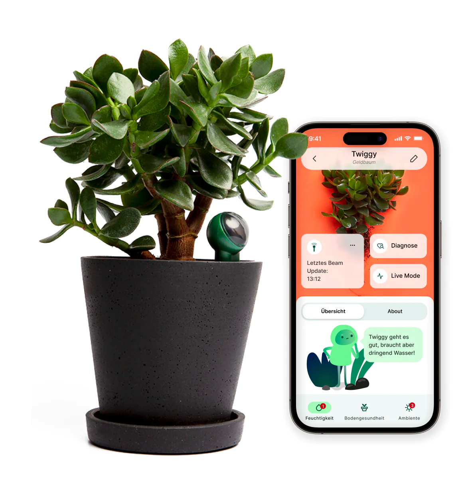

# Fyta Beam Binding

This binding links [Fyta Beam plant sensors](https://fyta.de/en) via the cloud. 


<br/>


## Supported Things

* `account` = Fyta account
* `plant` = A plant with a Fyta Beam sensor 

## Discovery

Create a `account` bridge and perform discovery. Your registered plants with Beam sensors will appear.

## Thing Configuration

See full example below for how to configure using thing files.

To find the `macAddress`, add the bridge and let it discover your locks.

### Account Thing Configuration

* `email` = Email address used in the mobile app
* `password` = Same as you use in the mobile app

### Plant Thing configuration

* `macAddress` = MAC address of Beam sensor

## Channels

Also see Thing properties. Plant names etc can be found there.

| Channel            | Type                 | Read/Write | Description                                                            |
|--------------------|----------------------|------------|------------------------------------------------------------------------|
| `temperature-status` | `String`              | R | Plant happyness with temperature. See plant happyness codes below      |
| `light-status`       | `String`               | R | Plant happyness with light conditions. See plant happyness codes below |
| `moisture-status`    | `String`               | R | Plant happyness with soil moisture. See plant happyness codes below    |
| `salinity-status`    | `String`               | R | Plant happyness with soil salinity. See plant happyness codes below    |
| `temperature`        | `Number:Temperature`   | R | Average temperature last hour                                          |
| `light`              | `Number`               | R | Average light amount last hour                                         |
| `moisture`           | `Number:Dimensionless`      | R | Average soil moisture/humidity last hour                               |
| `salinity`           | `Number`               | R | Average soil salinity last hour                                        |
| `battery`            | `Number:Dimensionless` | R | Remaining battery percentage                                           |
| `last-updated`       | `DateTime`             | R | Last data received from sensor                                         |

### Plant happyness codes

* `TOO_LOW`
* `LOW`
* `PERFECT` - aim for this
* `HIGH`
* `TOO_HIGH`

## Full Example

### Thing Configuration

```
Bridge fyta:account:account  "Fyta Account Bridge" [ email="***********", password="********"] { 
    Thing plant beam_1 "Palm plant" [macAddress="00:AA:BB:CC:DD:EE"]
    Thing plant beam_2 "Lizzie Izzy" [macAddress="11:AA:BB:CC:DD:EE"]
}
```
### Item Configuration

```
// Actual values
Number:Temperature Sensor_Fyta_1_Temperature "Palm temp [%d %unit%]" <temperature>   {channel="fyta:plant:account:beam_1:temperature"}
Number Sensor_Fyta_1_Light "Palm sunlight" <sun>                                     {channel="fyta:plant:account:beam_1:light"}
Number:Dimensionless Sensor_Fyta_1_Soil_Moisture "Palm soil moisture" <humidity>     {channel="fyta:plant:account:beam_1:moisture"}
Number Sensor_Fyta_1_Soil_Salinity "Palm salinity" <oil>                             {channel="fyta:plant:account:beam_1:salinity"}

// Aggregated status values based on Fyta knowledge
String Sensor_Fyta_1_Status_Temperature "Palm temp status" <QualityOfService>        {channel="fyta:plant:account:beam_1:temperature-status"}
String Sensor_Fyta_1_Status_Light "Palm light status" <QualityOfService>             {channel="fyta:plant:account:beam_1:light-status"}
String Sensor_Fyta_1_Status_Moisture "Palm moisture status" <QualityOfService>       {channel="fyta:plant:account:beam_1:moisture-status"}
String Sensor_Fyta_1_Status_Salinity "Palm salinity status" <QualityOfService>       {channel="fyta:plant:account:beam_1:salinity-status"}

// Battery and 
Number:Dimensionless Sensor_Fyta_1_Battery "Palm" <battery>                          {channel="fyta:plant:account:beam_1:battery"}
DateTime Sensor_Fyta_1_Last_Updated "Palm last updated" <time>                       {channel="fyta:plant:account:beam_1:last-updated"}
```
